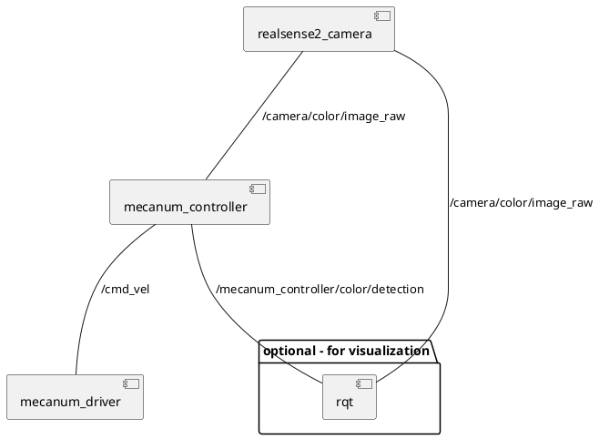

# High-Level Software UML Diagram 

```plantuml
@startuml
component mecanum_driver
component mecanum_controller
package "optional - for visualization" {
component rqt
}
component realsense2_camera

realsense2_camera --- rqt : /camera/color/image_raw
mecanum_controller --- rqt : /mecanum_controller/color/detection
realsense2_camera --- mecanum_controller : /camera/color/image_raw
mecanum_controller --- mecanum_driver : /cmd_vel
@enduml
```
